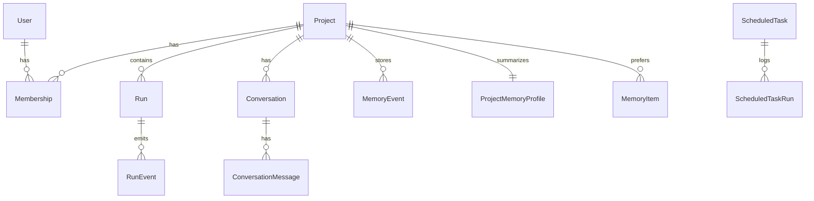

# ProcessDoc Studio — architecture

## Service boundaries

- **FastAPI API** ([`backend/app/main.py`](backend/app/main.py)): HTTP routes, auth, health, metrics. Lifespan starts the in-process local run worker and optional scheduler.
- **Run execution** ([`backend/app/services/run_worker.py`](backend/app/services/run_worker.py)): Coordinates LLM/agent work per run; persists `Run` / `RunEvent`; optional **Redis** for queue + SSE pub/sub across processes.
- **Run queue runtime** ([`backend/app/services/run_queue/runtime.py`](backend/app/services/run_queue/runtime.py)): Encapsulates local threaded queue, Redis client, dead-letter storage, and worker heartbeats.
- **Frontend** ([`frontend/`](frontend/)): Next.js app; TanStack Query for server state; auth wrapper uses shared [`apiFetch`](frontend/lib/apiClient.ts) (timeout + GET retries).

## Run queue modes

| Mode | When | Notes |
|------|------|--------|
| `local` | Default | Single-process in-memory queue + daemon thread in API process. |
| `redis` | `RUN_QUEUE_BACKEND=redis` | Cross-process queue; API does not start local worker; use external worker entrypoint. |

## Configuration

- Centralized in [`backend/app/core/config.py`](backend/app/core/config.py) (`pydantic-settings` / `Settings`).
- **Production / staging**: `PROCESSDOC_ENV` must use a strong `JWT_SECRET` (not `change-me`, min 16 chars).

## Entity overview (ERD)

Core relationships (simplified; see [`backend/app/db/models.py`](backend/app/db/models.py) for columns and constraints).

## Observability

- Request timing + **correlation ID**: [`backend/app/core/middleware.py`](backend/app/core/middleware.py) sets `X-Request-ID` (echo client `X-Request-ID` or generate UUID) and logs duration.
- In-process metrics: [`backend/app/services/observability.py`](backend/app/services/observability.py); `/metrics` and `/metrics/prometheus`.
- Readiness: `GET /health/ready` checks database and Redis when the queue backend requires it.
- ADD-001 v5 release metrics to alert on: `fanout_failures_total`, `retry_transition_invalid_total`, `hook_timeout_total`, `hook_skip_total`, `sse_replay_continuity_check_total`.

## Release gate (ADD-001 v5)

- Migrations: apply cleanly on both empty and existing databases, including `010_run_controls_and_hook_execution`.
- Contract tests: run-event schema remains stable (`schema_version`, envelope fields, typed phases).
- Runtime resilience: control/retry/hook tests pass under repeated and mixed event scenarios.
- Governance: policy supports dry-run/enforce switch, and hooks are visible/disable-able via API.
- Monitoring baseline: counters are present and stable for a 48h soak window before rollout.

## Coordinator

See the class docstring on `Coordinator` in [`backend/app/agents/coordinator.py`](backend/app/agents/coordinator.py) for the state machine and routing summary.

For how this compares to Claude-style **agent swarms / teammate** orchestration (shared task boards, TeammateTool, worktrees), see [`docs/AGENT_SWARM_GUIDE_GAP_ANALYSIS.md`](docs/AGENT_SWARM_GUIDE_GAP_ANALYSIS.md). Optional in-app swarm mode: `SWARM_ORCHESTRATION_ENABLED`, API [`backend/app/api/swarm.py`](backend/app/api/swarm.py), bridge in [`run_worker.py`](backend/app/services/run_worker.py).
