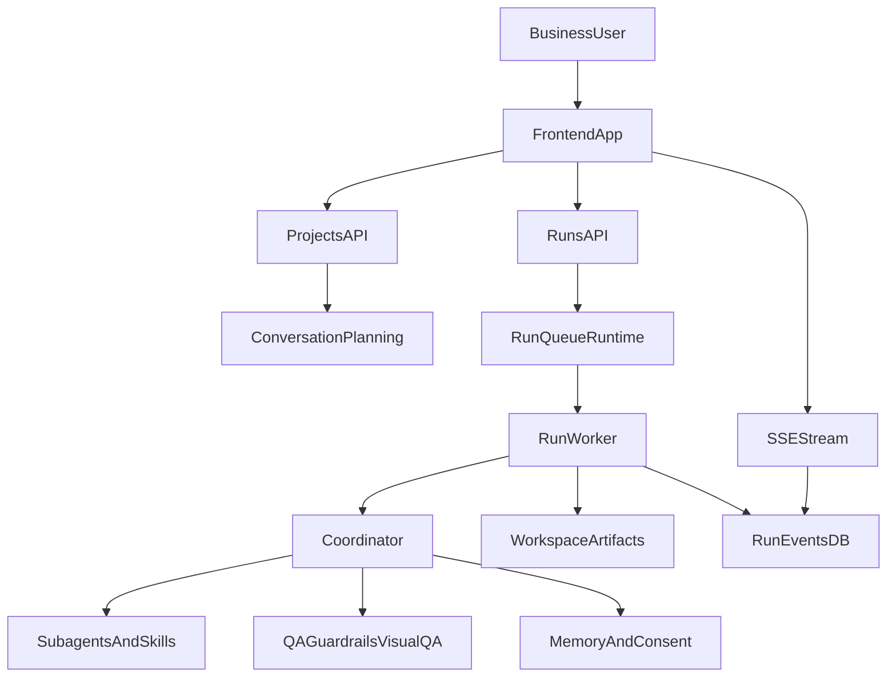

# Business Requirements Document (BRD)

## Document Control

- Document Title: ProcessDoc Studio Full-Platform BRD
- Version: 1.0
- Date: 2026-03-31
- Owner: Product and Business Analysis
- Status: Draft for stakeholder review

## 1. Executive Summary

ProcessDoc Studio is a workflow platform that converts business instructions and source documents into structured deliverables (DOCX, PPTX, XLSX, PDF, process maps) using an AI-assisted planning and execution pipeline. The platform supports human-in-the-loop checkpoints, quality and compliance gating, event-streamed run visibility, and artifact traceability.

The business objective is to reduce cycle time and improve consistency in producing consulting-grade process documentation, requirements artifacts, and executive communication outputs while preserving governance through approvals, audit trails, and configurable controls.

## 2. Business Context and Problem Statement

Organizations currently generate process and requirements artifacts through fragmented manual workflows, leading to:

- inconsistent quality and document structure across teams,
- long turnaround times for first draft and revisions,
- weak traceability from instruction to final deliverable,
- limited visibility into run status and quality/compliance checks.

ProcessDoc Studio addresses these gaps by combining instruction planning, skill-based generation, quality gates, and governed finalization into one orchestrated platform.

## 3. Goals, Objectives, and Success Metrics

### 3.1 Business Goals

- Standardize artifact production quality across teams and engagements.
- Reduce time from instruction to review-ready deliverables.
- Improve transparency and control for approvals, retries, and compliance checks.

### 3.2 Measurable Success Metrics

- First review-ready draft time reduced by at least 40% from baseline.
- At least 90% of runs reach review-ready state without manual recovery.
- Fewer than 5% of runs fail due to missing/invalid output artifacts.
- At least 95% of runs maintain complete event timeline traceability.

## 4. Stakeholders and User Roles

- Sponsor: Business transformation leadership.
- Primary users: Analysts, consultants, and delivery managers.
- Review and approval users: Project owners and editors.
- Compliance stakeholders: Data privacy and governance teams.
- Platform operations: Engineering and DevOps.

Role model (system-level):

- Owner: Full project administration and run control.
- Editor: Create/update plans, approve runs, finalize outputs.
- Viewer: Read-only access to run progress and artifacts.

## 5. Scope

### 5.1 In Scope

- Project/workspace setup and document ingestion.
- Instruction chat planning with decision prompts and plan confirmation.
- Skill-based output generation for supported formats.
- Run orchestration with queueing, approvals, retries, and status events.
- Quality, guardrails, and visual QA evaluation paths.
- Artifact packaging and download workflows.
- Memory/context assembly, consent-aware controls, and audit events.
- Operations visibility (health/readiness/metrics/worker state).

### 5.2 Out of Scope

- External enterprise identity provider integration requirements (beyond existing auth model).
- Custom downstream publishing workflows outside platform-managed artifacts.
- Domain-specific model training and fine-tuning lifecycle management.
- Contractual/legal governance process design outside tool support boundaries.

## 6. Current State and Target State

### 6.1 Current State

- Document creation is manual and tool-fragmented.
- Review loops are asynchronous and poorly instrumented.
- Quality controls are inconsistent across teams and artifact types.

### 6.2 Target State

- One platform-managed flow from instruction to review-ready outputs.
- Deterministic run states with explicit approval gates.
- Skill-driven generation with structured quality and compliance checks.
- Real-time run visibility and persistent event/audit history.

## 7. Functional Requirements

### 7.1 Project and Workspace Management

- **FR-01**: The system shall allow authorized users to create and manage projects.
- **FR-02**: The system shall maintain per-project workspaces for source files, parsed assets, run artifacts, and settings.
- **FR-03**: The system shall enforce role-based access (Owner/Editor/Viewer) at project scope.

### 7.2 Instruction Chat and Plan Confirmation

- **FR-04**: The system shall support instruction chat to generate a proposed execution plan with output recommendations.
- **FR-05**: The system shall provide guided decision prompts when required plan inputs are missing.
- **FR-06**: The system shall require explicit plan confirmation before run execution.
- **FR-07**: The system shall persist plan metadata (hash, outputs, representations, decision answers) for traceability.

### 7.3 Skill Discovery, Selection, and Prompting

- **FR-08**: The system shall discover built-in skills from `SKILL.md` definitions and include custom project skills when present.
- **FR-09**: The system shall select required and content skills by output type and instruction context.
- **FR-10**: The system shall apply plan-level content skill targets when provided for deterministic routing.
- **FR-11**: The system shall inject skill instructions, workflow steps, acceptance checks, and companion references into generation prompts.

### 7.4 Run Lifecycle and Orchestration

- **FR-12**: The system shall create runs in `plan_ready` status and require approval to execute.
- **FR-13**: The system shall enqueue approved runs using configurable queue backend modes (local/redis).
- **FR-14**: The system shall execute runs through coordinator-managed stages: context assembly, process extraction, output generation, QA, guardrails, visual QA, finalization.
- **FR-15**: The system shall support lifecycle controls (pause/resume/stop) where applicable.
- **FR-16**: The system shall persist run events and expose stream/poll endpoints for timeline replay.

### 7.5 Output Generation and Artifact Delivery

- **FR-17**: The system shall generate requested artifacts for supported output types.
- **FR-18**: The system shall persist artifact files and expose download-ready payloads with canonical filenames.
- **FR-19**: The system shall surface quality and guardrail reports as part of run outputs.

### 7.6 Quality, Guardrails, and Remediation

- **FR-20**: The system shall execute quality scoring against generated outputs using configured thresholds.
- **FR-21**: The system shall execute guardrail checks and persist guardrail events/reports.
- **FR-22**: The system shall execute visual QA and support evaluator-triggered remediation retries.
- **FR-23**: The system shall route failed runs to explicit failed states with error detail and audit events.

### 7.7 Memory, Consent, and Context

- **FR-24**: The system shall assemble run context from source text, memory events, profile summaries, and optional long-term memory items.
- **FR-25**: The system shall support consent-aware filtering controls for memory inclusion.
- **FR-26**: The system shall persist memory event summaries from run outcomes for future context reuse.

### 7.8 User Experience and Monitoring

- **FR-27**: The system shall provide an instruction-first interface for planning and run interactions.
- **FR-28**: The system shall provide live run visibility (events, status, checklist, tool activity).
- **FR-29**: The system shall display active skill routing context in run conversation/audit views.
- **FR-30**: The system shall provide dead-letter listing and replay/reset operations for recoverable queue failures.

## 8. Non-Functional Requirements

### 8.1 Performance and Scalability

- **NFR-01**: The platform shall support horizontal API scaling with Redis-backed queue mode.
- **NFR-02**: The platform shall maintain acceptable API latency at target load according to operations SLO gates.
- **NFR-03**: The platform shall support long-lived SSE/WebSocket connectivity with production proxy timeout configuration.

### 8.2 Availability and Reliability

- **NFR-04**: The platform shall expose health and readiness probes for orchestrated deployment checks.
- **NFR-05**: The platform shall provide retry/backoff and dead-letter mechanisms for execution resilience.
- **NFR-06**: The platform shall ensure run timeline durability via persisted run events.

### 8.3 Security and Privacy

- **NFR-07**: The platform shall enforce authenticated and role-authorized access to project and run resources.
- **NFR-08**: The platform shall support privacy controls for sensitive data handling (including consent-aware memory behavior).
- **NFR-09**: The platform shall support environment-level hardening for secrets and production-safe configuration.

### 8.4 Observability and Auditability

- **NFR-10**: The platform shall provide request correlation IDs and timing instrumentation.
- **NFR-11**: The platform shall expose platform and queue metrics in machine-readable formats.
- **NFR-12**: The platform shall support event-level run auditability from plan creation through finalization.

## 9. Data Requirements and Core Entities

Primary entities include:

- Identity and tenancy: Users, Projects, Memberships.
- Run execution: Runs, RunEvents.
- Planning and chat: Conversations, ConversationMessages.
- Memory and personalization: MemoryEvents, MemoryItems, ProjectMemoryProfile, UserProjectPreference.
- Consent and compliance: ConsentLedger, DPDP rights requests.
- Scheduling and operations: ScheduledTask, ScheduledTaskRun.

Data requirements:

- preserve immutable run timeline data for audit and replay,
- store plan confirmation metadata with hash consistency checks,
- retain artifact metadata and downloadable payload references,
- support configurable retention and compaction behavior for memory/event context.

## 10. Integration Requirements

- LLM integration for planning and generation.
- Redis integration for distributed queue mode and stream fanout.
- Relational database integration (SQLite for local, Postgres for scaled deployment).
- File/workspace persistence for source and output artifacts.
- Optional integrations for search/tooling and observability providers.

## 11. Constraints, Assumptions, Risks, and Mitigations

### 11.1 Constraints

- Distributed execution requires Redis queue mode and dedicated worker process.
- Production multi-user scaling requires Postgres; SQLite is local/single-node oriented.
- Streaming reliability depends on reverse proxy timeout/buffering configuration.

### 11.2 Assumptions

- Users follow plan confirmation and approval gates before expecting output generation.
- Workspace storage is durable and available to API and worker runtime.
- Required environment variables and secrets are managed via deployment controls.

### 11.3 Risks and Mitigations

- **R-01 Skill-routing drift risk**: incorrect/ambiguous content skill selection may reduce output quality.  
  Mitigation: persist and prioritize content skill targets for deterministic runs, emit skill selection audit events.
- **R-02 Retry loop quality risk**: remediation loops may converge slowly or produce repetitive output.  
  Mitigation: enforce bounded retries with explicit directives and evaluator checkpoints.
- **R-03 Operational drift risk**: local-friendly defaults used in production can degrade reliability.  
  Mitigation: enforce deployment profile guardrails and readiness checks for DB/Redis.
- **R-04 Compliance risk**: sensitive context leakage into memory artifacts.  
  Mitigation: consent-aware filtering and configurable enforcement toggles.

## 12. Acceptance Criteria

- **AC-01**: A user can create a project, upload context, confirm plan, and create a run successfully.
- **AC-02**: Approved runs transition through expected statuses and persist complete run events.
- **AC-03**: Requested deliverables are generated and downloadable in expected formats.
- **AC-04**: QA/guardrails/visual QA outputs are present and auditable for each completed run.
- **AC-05**: Event stream resumes correctly using persisted event IDs.
- **AC-06**: Failed runs provide actionable error and retry/dead-letter handling paths.

## 13. UAT Scenarios

### UAT-01: End-to-end plan-to-artifact flow

- Precondition: Authenticated editor with project access.
- Steps: Create project -> provide instruction -> resolve decisions -> confirm plan -> create run -> approve run -> review artifacts.
- Expected: Run reaches review-ready with generated artifact set and reports.

### UAT-02: Deterministic skill-routed run

- Precondition: Instruction requiring domain-specific skill.
- Steps: Confirm plan with explicit content targets -> create and approve run -> review run skill selection event.
- Expected: Selected skill aligns with plan targets and output structure.

### UAT-03: Stream continuity and replay

- Precondition: Running execution with events.
- Steps: Attach stream -> disconnect -> reconnect with `after_event_id`.
- Expected: No duplicate historical replay before cursor; new events continue.

### UAT-04: Failure and recovery operations

- Precondition: Simulated worker/queue failure or evaluator fail case.
- Steps: Observe failed/dead-letter state -> replay/reset attempts where allowed.
- Expected: Recovery path is explicit, auditable, and bounded by retry policy.

## 14. Release and Rollout Considerations

- Phase rollout from local mode to redis-backed distributed mode.
- Validate performance and queue SLO gates before production cutover.
- Validate security hardening checklist for JWT secret, config profile, and environment policy.
- Train user groups on plan confirmation and approval gates.

## 15. Requirements Traceability Matrix (High-Level)

| Requirement ID | Capability Area | Implementation Anchor (Module/API) |
|---|---|---|
| FR-04 to FR-07 | Instruction planning and confirmation | `backend/app/api/projects.py` |
| FR-08 to FR-11 | Skill discovery and prompting | `backend/app/services/skill_document.py`, `backend/app/agents/coordinator.py`, `backend/app/agents/subagents.py` |
| FR-12 to FR-16 | Run lifecycle and events | `backend/app/api/runs.py`, `backend/app/services/run_worker.py` |
| FR-17 to FR-19 | Artifact generation and delivery | `backend/app/services/storage.py`, `backend/app/api/run_artifacts.py` |
| FR-20 to FR-23 | QA/guardrails/visual QA | `backend/app/services/qa.py`, `backend/app/services/guardrails.py`, `backend/app/services/visual_qa.py` |
| FR-24 to FR-26 | Memory and consent-aware context | `backend/app/services/memory_context.py`, `backend/app/api/memory.py` |
| NFR-04 to NFR-06 | Reliability and operations | `backend/app/main.py`, `backend/app/services/run_queue/runtime.py`, health/metrics APIs |

## 16. Appendix A: System Relationship View

## 17. Appendix B: DOCX Conversion Notes

- Preserve heading hierarchy exactly as-is for Word styles mapping.
- Keep requirement IDs (`FR-*`, `NFR-*`, `AC-*`, `UAT-*`) unchanged for downstream traceability.
- Maintain tables for traceability and release governance sections.
