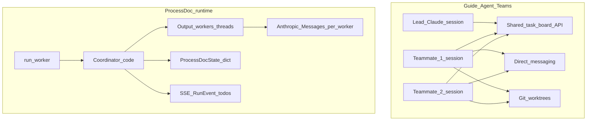

# Guide vs ProcessDoc codebase — architectural differences

## Scope

The reference guide describes **Claude Agent Swarms / Agent Teams**: a **lead** you talk to, **independent teammate Claude instances**, a **shared task board** with generic `TaskCreate`/`TaskUpdate`, **peer messaging** (`TeammateTool`: spawn, message, broadcast, cleanup), and **git worktrees** per agent for file isolation.

This repo is **Process Doc v2**: a **FastAPI + Next.js** product whose “agents” are **backend orchestration** around document generation runs ([`backend/app/agents/coordinator.py`](../backend/app/agents/coordinator.py), [`backend/app/agents/subagents.py`](../backend/app/agents/subagents.py), [`backend/app/services/run_worker.py`](../backend/app/services/run_worker.py)). It does **not** implement Claude Code’s experimental Agent Teams API or `TeammateTool`.

---

## 1. Lead agent (orchestrator)

| Guide | ProcessDoc |
|--------|------------|
| Lead is a **Claude session** that plans, spawns teammates, synthesizes. | **Orchestration is mostly deterministic Python** in `Coordinator.run`: DPDP, context assembly, routing by `requested_outputs` / run contract, QA loop, guardrails (`coordinator.py` class docstring). |
| User-facing “lead” chat | **Run Studio / conversations** are separate from the swarm model; there is no in-product “lead agent” that spawns other Claude sessions via a team API. |

**Difference:** No persistent **LLM-as-lead** managing a team; the **coordinator is code** with optional **Claude inside each deliverable worker**.

---

## 2. Teammate (worker) agents

| Guide | ProcessDoc |
|--------|------------|
| Each teammate = **independent Claude** with fresh context, runs until idle, can message others. | Workers are **functions** (`run_narrative_agent`, `run_docx_agent`, …) in [`subagents.py`](../backend/app/agents/subagents.py). Each may call [`run_subagent_tool_loop`](../backend/app/services/claude_tools.py): a **bounded multi-round Messages API loop** (custom tools, `subagent_tool_max_rounds` / `subagent_tool_max_tokens` from [`config.py`](../backend/app/core/config.py)). |
| Long-lived teammate processes | **One-shot per output type per run** (loop ends; no standing teammate). |

**Difference:** Matches the guide’s table row **“Subagents”** more than **“Agent Teams”**: **no separate persistent Claude instances** and **no direct agent-to-agent protocol**.

---

## 3. Task queue (shared board)

| Guide | ProcessDoc |
|--------|------------|
| Generic tasks with `dependsOn`, `priority`, `TaskList`, worker ownership. | **Fixed pipeline checklist** built in [`run_todo_snapshot.py`](../backend/app/services/run_todo_snapshot.py) (`build_run_todo_rows`: context → process_model → plan → `out:{type}` → qa → guardrails → …). Status driven by coordinator phases + `emit_run_todo_snapshot` for SSE/UI. |
| Arbitrary task graph | **Run contract** can impose **ordered nodes** (sequential per node in `coordinator.py` ~1192–1218); otherwise **parallel fan-out** over output types (~1221–1233). |

**Difference:** **Not** a general `TaskCreate`/`TaskUpdate` API; **UI-oriented milestones**, not a multi-agent work-stealing board.

---

## 4. Inter-agent messaging

| Guide | ProcessDoc |
|--------|------------|
| `TeammateTool` message / broadcast; peers coordinate without lead relay. | **No** teammate messaging. Coordination is **shared `ProcessDocState`**, **merge of `AgentOutput`**, and **run events** (e.g. tool rounds, todos). |
| | Optional **hooks** ([`hooks.py`](../backend/app/services/hooks.py)) are **webhooks**, not agent mail. |

**Difference:** **No** `TeammateTool` or peer message bus.

---

## 5. Parallelization and context

| Guide | ProcessDoc |
|--------|------------|
| True parallel **independent context windows** (3× cost, 3× speed story). | Parallelism via **`ThreadPoolExecutor`** (`max_workers` capped, e.g. `min(4, …)` in `coordinator.py` ~1183–1226). Each worker gets an [`AgentContext`](../backend/app/agents/agent_types.py) snapshot from **`build_agent_context(state, output_type)`** (read-focused slice). |
| | **Separate Anthropic calls** per worker can reduce *per-call* context size vs one mega-call, but it is **not** the same as Claude Code **Agent Teams** product feature. |

**Implementation note:** Parallel output workers use **`defer_state_merge=True`** so `AgentOutput` / dict updates are **merged on the main thread** after each future completes, avoiding concurrent writes to the shared `state` dict from multiple threads.

---

## 6. File conflict prevention (git worktrees)

| Guide | ProcessDoc |
|--------|------------|
| `.claude/teams/.../worktree-*` per agent; lead merges. | **No** agent worktrees in-repo. Artefacts are tied to **run/project storage** via the normal app persistence, not per-agent clones. |

**Difference:** **No** automated multi-worktree file locking/merge for agents.

---

## 7. TeammateTool API

| Guide | ProcessDoc |
|--------|------------|
| `spawnTeam`, `message`, `broadcast`, `stopTeammate`, `cleanup`. | **Absent.** Tooling is **registry + MCP bridge** ([`README.md`](../README.md); [`backend/app/services/mcp/`](../backend/app/services/mcp/)) and **subagent custom tools** in `run_subagent_tool_loop`, not team lifecycle APIs. |

---

## 8. Patterns (supervisor, pipeline, generator–evaluator)

| Pattern | Guide | ProcessDoc |
|---------|--------|------------|
| **Supervisor** | Lead spawns domain specialists. | **Coordinator** fans out to output-type workers; **no** named Frontend/Backend/Test Claude teammates. |
| **Pipeline** | Linear ETL. | **Strong fit:** context → extraction → plan → outputs → QA → guardrails → finalize. |
| **Generator–evaluator** | Tight loop between two agents. | **Partial:** [`QAAgentLoop`](../backend/app/services/qa.py) + deliverable quality / remediation in coordinator—not a symmetric peer “evaluator” agent with messaging. See [`v4_deviations_audit_6b950868_report.md`](../v4_deviations_audit_6b950868_report.md). |

---

## 9. Best practices from guide (mapped)

- **WORKER preamble (“do not spawn agents”)** — Relevant to **prompts inside skills/subagents**, not enforced by a platform TeammateTool; workers cannot spawn teammates because **that API does not exist** here.
- **Explicit task dependencies** — Only as far as **run contract node order** and **output-type ordering**; not arbitrary DAG tasks.
- **Lead validation** — **Code paths** (QA, guardrails, optional remediation), not a final “lead-only” Claude task.
- **Token/cost** — Controlled by **per-subagent caps** and **parallel fan-out**, not by team-size settings from the guide.

---

## 10. Cursor / IDE layer (out of repo)

The **Cursor `Task` tool** (subagents in the editor) is **orthogonal** to ProcessDoc’s backend coordinator. The guide’s **Agent Teams** flag (`CLAUDE_CODE_EXPERIMENTAL_AGENT_TEAMS`) is a **Claude Code product** concern, **not** referenced in this application codebase.

---

## Summary table

| Guide concept | In ProcessDoc? |
|---------------|------------------|
| Independent teammate Claude sessions | **No** (bounded subagent loops per output) |
| TeammateTool / spawn / message / broadcast | **Partial** (HTTP + DB messages; not Claude Code tool) |
| Generic shared task board API | **Partial** (`RunTask` + `depends_on` + swarm CRUD when flag on) |
| Direct inter-agent messaging | **Partial** (`swarm_messages` + SSE `swarm_message`) |
| Git worktrees per agent | **No** (directory sandboxes only) |
| Lead-as-Claude orchestrator | **No** (Python coordinator) |
| Parallel workers + specialist roles | **Yes** (thread pool + `subagents.py`) |
| Pipeline + QA/guardrails | **Yes** (with documented QA depth gaps vs v4 spec) |
| Tool loops + MCP scaffold | **Yes** |

---

## Implementation status (swarm subsystem)

When **`SWARM_ORCHESTRATION_ENABLED=true`** (see [`backend/app/core/config.py`](../backend/app/core/config.py)):

| Area | Location |
|------|----------|
| Schema | [`SwarmTeam` / `SwarmTeammate` / `SwarmMessage`](../backend/app/db/models.py), extended [`RunTask`](../backend/app/db/models.py), migration [`013_swarm_orchestration.py`](../backend/alembic/versions/013_swarm_orchestration.py) |
| Task DAG + enrichment | [`app/services/swarm.py`](../backend/app/services/swarm.py) (`enrich_run_todos_with_dependencies`, `validate_task_dag`, `ready_task_ids`) |
| Scheduler facade | [`app/services/swarm_scheduler.py`](../backend/app/services/swarm_scheduler.py) |
| Run bridge | [`run_worker._emit_and_sync_todo_snapshot`](../backend/app/services/run_worker.py) materializes `depends_on` into DB rows; [`run_tasks.sync_run_tasks_from_snapshot`](../backend/app/services/run_tasks.py) persists `depends_on_json` |
| HTTP API | [`app/api/swarm.py`](../backend/app/api/swarm.py) — `GET/POST .../swarm`, tasks CRUD, messages, broadcast, lead plan preview |
| Lead (deterministic + LLM hook) | [`lead_plan_with_optional_llm`](../backend/app/services/swarm.py) |
| Sandboxed paths + promote | [`teammate_workspace_dir`](../backend/app/services/swarm.py), [`promote_teammate_artifacts`](../backend/app/services/swarm.py) |
| UI | [`SwarmPanel`](../frontend/components/run-studio/SwarmPanel.tsx) on Run Studio |
| Metrics | Counters `swarm_*_total` via [`observability.increment`](../backend/app/services/observability.py) in swarm routes |
| Tests | [`app/tests/test_swarm.py`](../backend/app/tests/test_swarm.py) |

Still **not** the Claude Code product **TeammateTool** or **git worktrees** per agent; teammates are **logical** rows and filesystem sandboxes are **directory-based** under `WORKSPACE_ROOT`.

---

## Further improvements (optional next steps)

1. **Stronger isolation** — Parallel path merges on the main thread (see §5). **Git worktrees** remain optional.
2. **Executor integration** — Have subagent `native_context` use `teammate_workspace_dir` for every tool call; wire **Redis-backed** worker processes to [`SwarmScheduler`](../backend/app/services/swarm_scheduler.py).
3. **True multi-session teams** — External Claude Code / API adapter if/when available.
